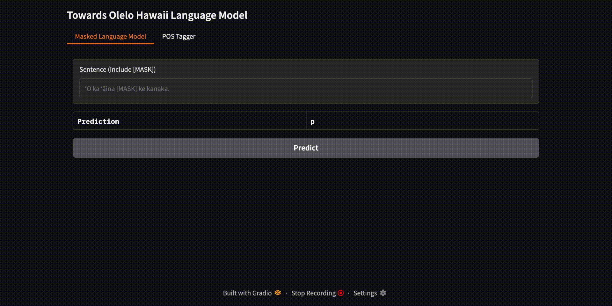
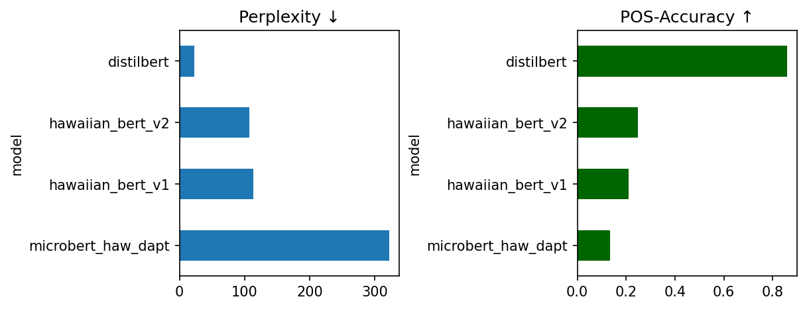
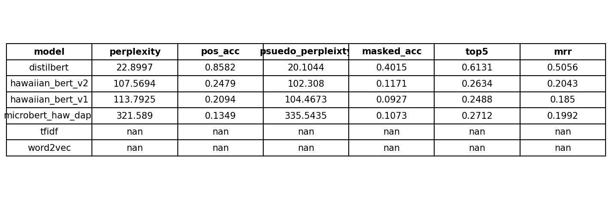

# Towards an ʻŌlelo Hawaiʻi Language Model

## Overview


`haw-lm` is a compact, reproducible pipeline we use in-house to clean our Hawaiian text corpus, tokenize it, train on raw Hawaiian sentences, and fine-tune for Part-of-Speech tagging, while logging every stage using MLflow and Prefect. It includes both transformer-based models (e.g., BERT variants) and traditional static embeddings (Word2Vec, TF-IDF) for comparative benchmarking.

The project is designed for seamless experimentation, fine-tuning, hyperparameter optimization, evaluation, and documentation of multiple models defined in the experiment `.yaml`. Hyperparameter tuning is supported via a simple YAML configuration under the `search` property, enabling rapid experimentation across learning rates, batch sizes, and other key parameters.

To support evaluation and comparison, the system automatically generates a leaderboard that compares masked language model quality (via pseudo-perplexity, top-5 accuracy, and mean reciprocal rank) and POS tagging performance (accuracy and macro F1). The current version runs on the **Kahupuke** (raw Hawaiian sentences) dataset and the **Annotated POS** (CoNLL-U format) dataset.

## Stages
The pipeline consists of the following stages:

1. **Clean**: Preprocess raw text into a clean hawaiian corpus
2. **Tokenize**: Apply subword tokenization using from the given tokenizer
3. **Train**: Train or Fine-tune a transformer model with configurable parameters
4. **Evaluate**: Compute basic evaluation metrics such as perplexity and accuracy. It also produces `/artifacts/leaderboard.png` to evaluate any given models as defined in the experiment.
5. **Log**: Store experiment metadata and training curves using MLflow

> *Note: Monitoring between phases can also be integrated using Discord Webhooks. This is useful for asynchronous notifications for those long training time and unexpected event failures. You can view Prefect for pipeline monitoring and MLFlow for model analysis and monitoring when doing experiments.*


## 📊 Leaderboard: Model Benchmarking

Our pipeline automatically generates visual leaderboard reports at:

```
artifacts/leaderboard.png
artifacts/leaderboard_table.png
```

These leaderboard images are **continuously updated** during experiments and model refinement. They serve as a key artifact in our comparative benchmarking study, allowing easy comparison across models, architectures, and configurations.


> *Note: hawaiian_bert model is a sanity test to ensure from-scratch BERT models can be incorporated into our architecture*





### Use Models

Models are under `/data2/jeraldy/haw-lm/models`. It consists of the pretrain model (raw olelo hawaiian) and fine-tuned model (part of speech tagging).

### Current Benchmark Summary

### Evaluation Metrics

| Metric                | Description                                                                    |
| --------------------- | ------------------------------------------------------------------------------ |
| **POS Accuracy**      | Overall % of correctly predicted POS tags.                                     |
| **Macro F1 Score**    | F1 score averaged across all POS classes equally. Helps in low-resource tags.  |
| **Top-5 Accuracy**    | If the correct token is in the top 5 MLM predictions during fill-mask.         |
| **MRR**               | Average reciprocal rank of the correct token across MLM fill-mask predictions. |
| **Pseudo-Perplexity** | Token-level pseudo-perplexity from MLM; lower = better fluency.                |


## Feature Flags

The pipeline supports runtime feature toggles within the `.yaml` files. These flags allow you to control optional behaviors such as REPL demos and Discord notifications without modifying the flow code.

Update your `params.yaml` with a `feature_flags` section like this:

```yaml
feature_flags:
  notifications:
    discord_enabled: false     # Sends a Discord alert with run metrics when enabled
  devtools:
    repl_enabled: true         # Launches optional REPLs after training and POS tagging
```

### Available Flags

| Flag                            | Description                                                                                           | Default |
| ------------------------------- | ----------------------------------------------------------------------------------------------------- | ------- |
| `notifications.discord_enabled` | Sends Discord alerts after the run using a webhook URL stored in `DISCORD_HOOK`.                      | `false` |
| `devtools.repl_enabled`         | Launches the interactive REPL for fill-mask and POS tagging demos. Useful for quick testing model behavior. | `true`  |

### Notes

* The Discord webhook URL must be set via an environment variable. Create a `.env` file in the root directory, and add the following code with respect to your personal Discord webhook url in your server:

  ```bash
  export DISCORD_HOOK="https://discord.com/api/webhooks/your-webhook-url"
  ```
* When a flag is missing in `params.yaml`, the pipeline falls back to its default value.

## Reproducibility

Install all dependencies with:

```bash
pip install -r requirements.txt
```

## Datasets

The pipeline uses two primary datasets:

| Dataset Name | Description                                                                 | Usage                                      |
|--------------|-----------------------------------------------------------------------------|--------------------------------------------|
| **Kahupuke** | Raw Hawaiian sentences used for unsupervised Masked Language Modeling (MLM) | Trains the MLM model on raw Hawaiian text  |
| **Makana**   | Part-of-Speech (POS) annotated Hawaiian sentences in CoNLL-U format         | Fine-tunes and evaluates POS tagging model |

### Dataset Propagation

To support experiment scaling, the pipeline includes a dataset sampler:

```python
sample_corpus("data/raw_sentences_test.txt", sampled_corpus_file, fraction=sample_fraction, shuffle=False)
````

* **Fraction control**: Set via `.yaml` under `data_size` (e.g. `0.1`, `1.0`)
* **Shuffling**: Optional deterministic shuffling for reproducibility
* **Output**: Writes sampled corpus to `data/corpus_{fraction}x.txt`

### Cleaning & Tokenization Flow

The preprocessing pipeline includes:

1. **Cleaning**
   The `step_clean()` task normalizes the sampled corpus:

   ```
   data/corpus_{fraction}x.txt → data/clean.txt

2. **Tokenization**
   The `step_tokenize(cfg)` task tokenizes the cleaned corpus using the tokenizer specified in the config.

   * If `train_from_scratch: true`, a new tokenizer is built using:

     ```python
     train_tokenizer.run(
         corpus_file="data/clean.txt",
         out_dir="tokenizers/{name}",
         vocab_size=...,
         min_frequency=...
     )
     ```
   * Otherwise, a pre-existing tokenizer from a out of the shelf transformer model is reused.


## Makefile Commands

For convenience, key pipeline actions are wrapped in a `Makefile`. These commands improve reproducibility and make it easier to run experiments consistently.

| Command                   | Description                                                                 |
|---------------------------|-----------------------------------------------------------------------------|
| `make run_sanity`| Runs a fast experiment with minimum data. This is useful for sanity checking the pipeline. |
| `make run_multi_model`| Runs the full pipeline with multiple models and benchmark perplexity and POS accuracy results. To run a single model experiment, you can simply define a single model. |

For example, this will demostrate the end-to-end pipeline for sanity purposes. It should complete the entire run in ~3 minutes:

```bash
make run_sanity
```

### Usage

To monitor the pipeline and models with advance tooling:

```bash
mlflow ui
prefect server start
```


## Models and Integration

`haw-lm` pipeline has two critical stages:

1. **Masked Language Model (MLM)**
   The model is trained on raw hawaiian sentences from the Kahupuke dataset for masked language modeling. Models can either be built from scratch in the `.yaml` file or grabbed off-the-shelf from the huggingface library (e.g. `distilbert-base-multilingual-cased`)
   → Output directory: `[model-name]/checkpoint-*`

2. **POS Tagging Model**
   Once the model is trained on raw hawaiian text, it is then fine-tuned on token-level Part-of-Speech tagging from the Makana datset.
   → Output directory: `model_out/[model-name]/pos`

### Sample Configurations

Below are a configuration samples that can be used in `multi_model_experiment.yaml`, one for a **scratch-built model**, and one for a **pretrained model** that does continued learning on Kahupuke Dataset, then automatically fine-tuned for Part of Speech Tagging.

```
- name: hawaiian_bert
  model_type: bert
  model_name: hawaiian-bert-from-scratch
  checkpoint_path: model_out/hbert/checkpoint-0
  pos_output_dir: model_out/pos_hbert
  train_from_scratch: true

  data_size: 0.001
  tokenizer_path: ""
  vocab_size: 32000
  min_freq: 2

  max_length: 128
  learning_rate: 3e-5
  batch_size: 32
  num_epochs: 3
  max_steps: 1000
  mlm_probability: 0.15
  train_split: 0.9
  seed: 1337
  ignore_label: -100
  pos_model_dir: model_out/pos_hbert

  hidden_size: 256
  num_hidden_layers: 10
  num_attention_heads: 4
  intermediate_size: 1024

  feature_flags:
    notifications: { discord_enabled: true }
    devtools:       { repl_enabled: false }

- name: distilbert
  model_type: distilbert
  model_name: distilbert-base-multilingual-cased
  checkpoint_path: quick-haw-mlm/checkpoint-300
  pos_output_dir: model_out/pos_distil
  train_from_scratch: false

  data_size: 0.001
  tokenizer_path: ""

  max_length: 128
  learning_rate: 5e-5
  batch_size: 32
  num_epochs: 1
  max_steps: 300
  mlm_probability: 0.15
  train_split: 0.9
  seed: 42
  ignore_label: -100
  pos_model_dir: model_out/pos_distil

  feature_flags:
    notifications: { discord_enabled: true }
    devtools:       { repl_enabled: false }
````

To test and benchmark multiple models in one unified run using Makefile `make run_multi_model`. This will generate the `/artifacts` based on the configurations.

### How to Use the Models

The main inference demo can be found under `src/serve_latest.py`. This launches a Gradio app with hard-coded paths towards the model. Currently, it is set for a `distilbert-base-multilingual-cased` to which was used to do continious training for our Kahupuke dataset. Make sure you run the experiment to have the model established in the directory. You can run it at `python serve_latest.py`
You can also use demo scripts in the `scripts/` directory to try the models interactively once the models have been established in your local directory.


## Optional HITL: Label Studio POS Backend (`label_studio_pos_backend`)

If you’d like to add human-in-the-loop (HITL) review or bootstrap new POS annotations, the project ships with a **docker-free Label Studio ML backend** that streams tasks to your latest Hawaiian POS model and returns pre-annotations.

```
# Activate the env you already use for haw-lm
source /home/jeraldy/.venv/bin/activate
cd haw-lm/label_studio_pos_backend

# Ensure a spec-compliant SDK is present
uv pip install "label-studio-sdk>=1.0.19"

# Install the backend itself *without* pulling the old Git dependency
uv pip install -e . --no-deps

### Run the backend

export LABEL_STUDIO_URL=http://localhost:8080          # where LS is running
export LABEL_STUDIO_API_KEY=<your-api-token>           # Settings ▸ Account

label-studio-ml start label_studio_pos_backend \
    --host 0.0.0.0 --port 9090


*If Label Studio runs in Docker, connect via `http://host.docker.internal:9090`
when you add the model under Settings ▸ **Model**.*
```


## Contact Us

For questions or support regarding the `Towards an ʻŌlelo Hawaiʻi Language Model` project that was built for the Akamai 2025 Workforce Initiative Program, please reach out to:

- **Jerald Dancel**
  - Email: jeraldy@hawaii.edu
  - Role:  Project Lead / Mentee

- **Winston Wu**
  - Email: wswu@hawaii.edu
  - Role: NLP Specialist / Mentor

## Acknowledgements

The Akamai Internship Program is managed by the Institute for Scientist & Engineer Educators at the University of California Observatories, in partnership with the University of Hawai‘i at Hilo.

Funders for the 2025 program are:
- Gordon and Betty Moore Foundation
- National Science Foundation (through the Daniel K. Inouye
Solar Telescope, Gemini Observatory, HAKA instrument project,
and AST#174317)
- University of California Observatories
- Maunakea Observatories
